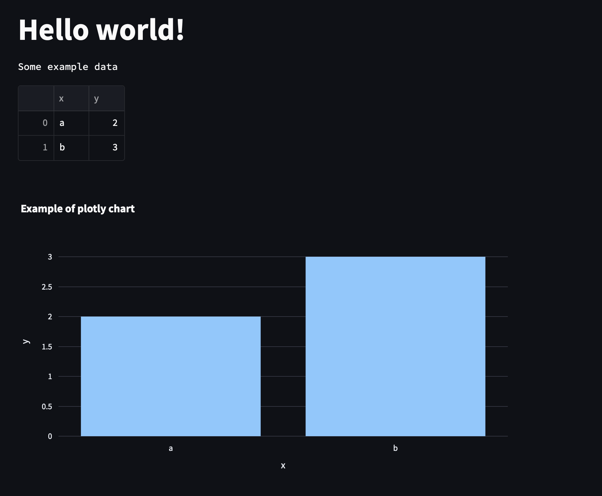

# cookiecutter-data-experimentation
Base repo for data experimentation with streamlit, plotly and duckdb

# Acknowledgements
This cookiecutter is inspired from https://github.com/fpgmaas/cookiecutter-poetry .

# How to use
1. `pip install cookiecutter`
2. Create a git repository for your project
3. Git clone the repository
4. Inside the repository directory execute
```
cookiecutter https://github.com/acirtep/cookiecutter-data-experimentation.git
```
5. Go through the questions and add the port of choice for your application
6. Inside the repository directory make sure to use python > 3.11 `poetry env use ...`
7. Run `poetry install`
8. `docker compose up`
9. Go to http://0.0.0.0:port of choice
10. A "hello world" Streamlit app is running 